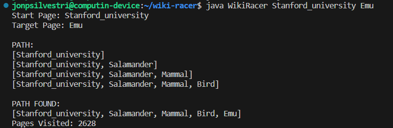

# wiki-racer
Finds and displays a path between two wikipedia articles using links embedded in Wikipedia articles

A start page and destination page can be given in the command line (2 total commandline arguments)

Output will include the path that was taken between the two pages, along with the total number of pages visited in the search

WikiRacer uses an association heuristic to determine which pages to traverse through. Possible paths are stored in a priority queue, where the priority value is calculated based on how many embedded links a the current page shares with the target page

## how to use
Clone this repository, and compile with ```make wikiracer```

Search can be run by providing the names of two Wikipedia arguments. ```arg1 -- source page``` ```arg2 -- target page```

The article titles given in the command line _are_ case-sensitive

EX: ```java WikiRacer Stanford_university emu```

clear executables with ```make clean```

## Sample output


